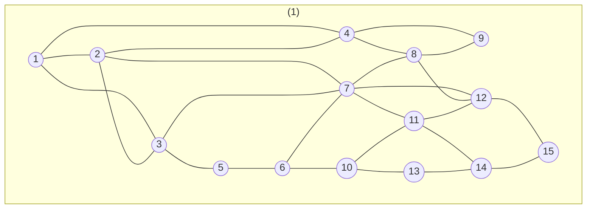
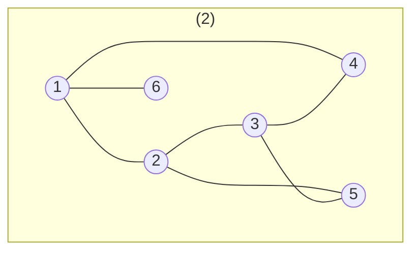
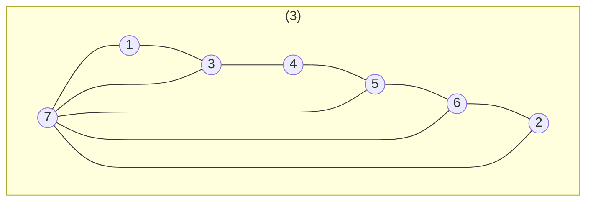
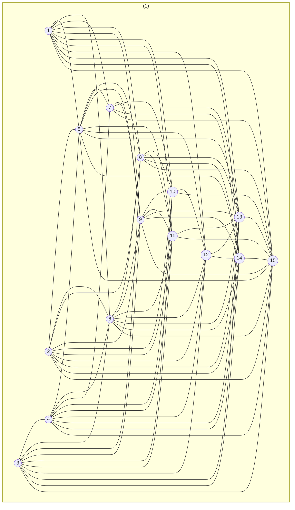
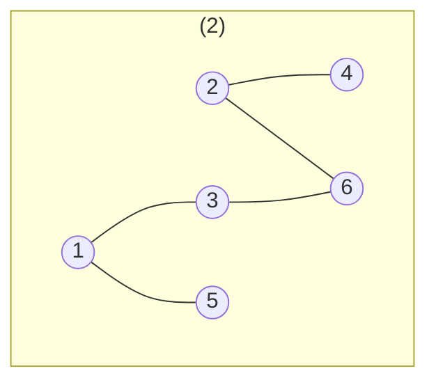
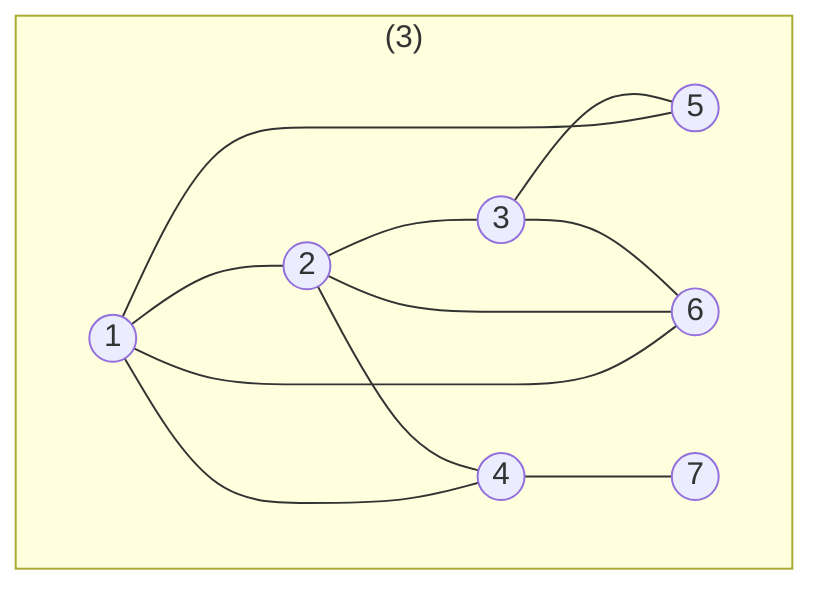
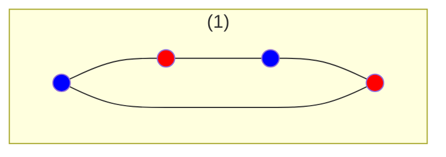
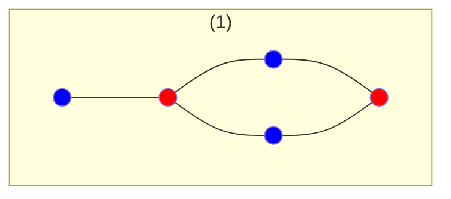
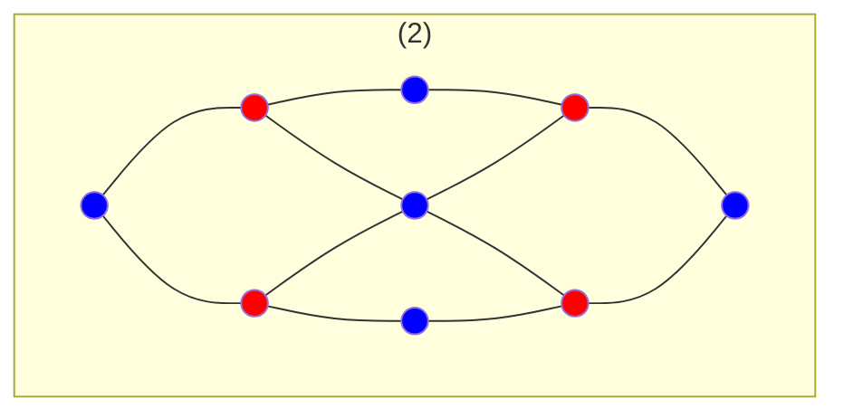
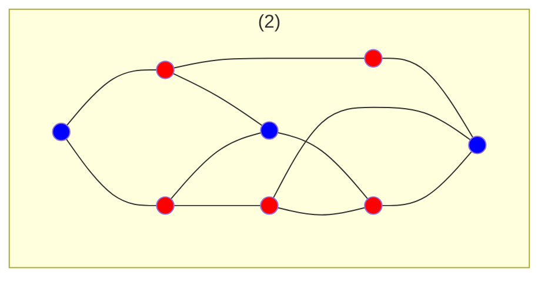

### Universidade Federal de Ouro Preto
#### Disciplina: BCC206 - Teoria dos Grafos
##### Professor: Marco Antonio M. Carvalho

<hr/>
<br/>

1.  Um escultor deseja criar uma escultura que represente a paz mundial. 
    Para isto, ele esculpirá 7 pilares (um para cada continente) e os 
    colocará em um círculo. Depois, ele esticará um fio de ouro entre os 
    pilares, de forma que, cada pilar estará conectado a 3 outros pilares.
    Embora a idéia seja boa, a escultura é impossível.
    Porquê?

Teorema do Aperto de Mãos:

```math
\displaystyle\sum_{i=1}^n d(i) = 2m
```

**O numero de vértices de grau impar em um GND é par.**

Ou seja este grafo deve ter ter grau par mas seu grau é 3*7 = 21

<hr/>







2.  Para os três grafos da figura acima, determine o fecho trasitivo do 
    vértice 1.

```math
f(1) = {2,3,4,5,6,7,8,9,10,11,12,13,14,15}
```

```math
f(1) = {2,3,4,5,6}
```

```math
f(1) = {2,3,4,5,6,7}
```
<hr/>

3.  Para os três grafos da figura acima, determine k(G).

```math
\kappa(K_{(n)})  n - 1
```

```math
\kappa(G)  \leq  n − 2  \forall  G {=}\mathllap{/\,}  K_{(n)}
```

```math
\kappa(G) = 2
```

```math
\kappa(G) = 1
```

```math
\kappa(G) = 1 
```

<hr/>

4.  Para os três grafos da figura acima, determine $\delta(G)$.

```math
\kappa(G)  \leq \delta(G)^a
```

```math
\delta(G) = 2  
```

```math
\delta(G) = 1
```

```math
\delta(G)  = 2 
```

<hr/>

5.  Para os três grafos da figura acima, determine o grafo complemento.








<hr/>

6.  Forneça um exemplo, se existir, de um grafo bipartido e regular.



7.  Forneça um exemplo, se existir, de um grafo em que k(G) < \delta(G).

8.  Prove que um grafo simples que contém n vértices é necessariamente
    conexo se ele tem mais de (n-1)(n-2)/2 arestas.

9.  Indique quais dos três grafos abaixo é bipartido.







<hr/>

10. Construa dois grafos de 5 vértices e 8 arestad que não sejam 
    isomorfos. Prove que ambos não são isomorfos.

11. Dentre os grafos abaixo, determine se há pares de grafos isomorfos.

12. Prove que uma aresta e de um grafo é uma ponte se e somente se ela 
    não fizer parte de nenhum ciclo deste mesmo grafo.

13. Para o grafo da figura abaixo, apresente a sequência de vértices após
    a aplicação da BFS a partir do vértice 3. Considera a representação
    por listas de adjacências em ordem lexicográfica.

14. Para o grafo da figura abaixo, apresente a sequência de vértices após
    a aplicação da BFS a partir do vértice 3. Considere a representação
    por listas de adjacências em ordem lexicográficas.


15. Para o grafo da figura abaixo, apresente a sequência de vértices após
    a aplicação da DFS a partir do vértice 6. Considere a representação
    por listas de adjacências em ordem lexicográficas.

16. Para o grafo da figura abaixo, apresente a sequência de vértices após
    a aplicação da DFS a partir do vértice 6. Considere a representação
    por listas de adjacências em ordem lexicográficas.

17. Execute o algoritmo de Dijkstra para determinar especificamente os 
    menores caminhos a partir do vertice A do grafo abaixo.


18. Execute o algoritmo de Dijkstra para determinar especificamente os 
    menores caminhos a partir do vertice B do grafo abaixo.

19. Execute o algoritmo de Bellman-Ford para o grafo abaixo, a partir 
    do vertice 0.

20. Execute o algoritmo de Bellman-Ford para o grafo abaixo, a partir 
    do vertice 1.
    
21. Elabore um exemplo de um grafo com 6 vertices de tal maneira que o
    caminho mais curto entre os vertices 1 e 6 somente podera ser 
    calculado pelo algoritmo de Bellman-Ford. Justifique o exemplo.

22. Para a rede abaixo, nas quais os rotulos apresentam os limites minimos
    e maximos para o fluxo em cada arco, adicione (se necessario) vertices
    e arcos artificiais para que todo vertice possua fluxo conservativo.

        (a) determine um fluxo viavel

        (b) determine o valor do fluxo maximo, pela aplicacao do algoritmo
            de Ford \delta Fulkerson. Prove que o valor do fluxo maximo e
            otimo, apresentando o corte minimo associado.

23. Para a rede abaixo, nas quais os rotulos apresentam os limites minimos
    e maximos para o fluxo em cada arco, adicione (se necessario) vertices
    e arcos artificiais para que todo vertice possua fluxo conservativo.

        (a) determine um fluxo viavel

        (b) o valor do fluxo maximo, pela aplicaçao 
        
24. Para a rede abaixo, nas quais os rótulos apresentam os limites 
    mínimos e máximos para o fluxo em cada arco, adicione 
    (se necessário) vértices e arcos artificiais para que todo vértice 
    possua fluxo conservativo, 

        (a) determine um fluxo viável 

        (b) o valor do fluxo máximo, pela aplicação do algoritmo 
            de Ford \delta Fulkerson.

    Prove que o valor do fluxo máximo é ótimo, apresentando o corte 
    mínimo associado.
